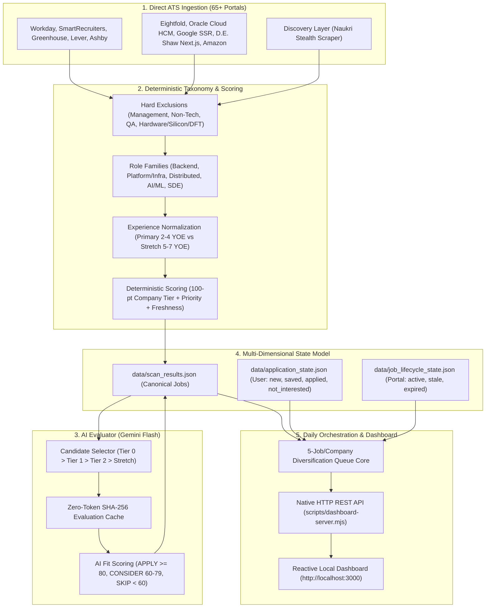

<div align="center">


# career-ops-india

**AI-powered job search pipeline for the Indian market**

Works with [Gemini CLI](https://github.com/google-gemini/gemini-cli) (free) and [Claude Code](https://claude.ai/code).  
Scan 65+ Tier 0/1/2 Indian company career portals, evaluate fit with a structured AI rubric, manage application lifecycles, and drive daily job hunts via a visual local Kanban dashboard.

[](https://nodejs.org)
[](https://github.com/AnojSKunte/career-ops-india)
[](LICENSE)

</div>

---

## 🎯 Architecture Overview

Career-Ops India is an agentic, zero-database career pipeline built with native Node.js and Python. It eliminates fragile web scrapers in favor of direct HTTP/REST/SSR protocol adapters, deterministic semantic role taxonomy, multi-tier ranking, AI-assisted fit evaluation, and orthogonal state management.



---

## 🚀 Daily Workflow

| Workflow Step | Command | Description |
|---|---|---|
| **1. Run Daily Job Hunt** | `npm run daily` | Single-click orchestration: scans portals, evaluates top 50 official candidates, re-builds curated 5/co queue, updates dashboard. |
| **2. Interactive Dashboard** | `npm run dashboard` | Opens local visual Kanban dashboard (`http://localhost:3000`) for review, application tracking, and manual expiration. |
| **3. CLI Application Queue** | `npm run queue` | Displays ranked, diversified CLI recommendations sorted by `APPLY NOW` > `CONSIDER` > `NEW`. |
| **4. Raw ATS Portal Scan** | `npm run scan` | Queries 65+ employer ATS APIs directly without evaluating AI tokens (~30 seconds). |
| **5. Discovery Ingestion** | `npm run discover:naukri` | Runs stealth aggregator scraper and merges candidates with official ATS precedence. |
| **6. Resume Tailoring** | `npm run pdf -- --company [X] --role [Y]` | Tailors CV bullets, injects JD keywords, and builds ATS-compliant PDF. |
| **7. Health Diagnostics** | `npm run doctor` | Verifies Node.js, Python environment, CV structure, and data integrity. |

---

## 🛠️ ATS Adapter Directory

Career-Ops India features 11 specialized protocol adapters in [`scripts/adapters/`](scripts/adapters/) querying structured JSON/REST endpoints:

- **Workday**: Visa, Mastercard, Adobe, Walmart, Target, Nvidia, AMD, Intuit
- **SmartRecruiters**: ServiceNow, Bosch, Sandisk, Western Digital
- **Greenhouse**: Okta, GitLab, Twilio, Postman, Stripe, Atlassian, Rubrik, Databricks
- **Lever**: Fi Money, Jupiter, CRED, Slice, Razorpay
- **Ashby**: Modern YC & AI engineering companies
- **Eightfold**: Microsoft, Morgan Stanley, BNY Mellon, Capital One
- **Oracle Cloud HCM**: JPMorgan Chase, Goldman Sachs
- **Google Careers**: Server-rendered `AF_initDataCallback (ds:1)` payload extraction
- **D.E. Shaw**: Next.js `__NEXT_DATA__` server-rendered regularJobs extraction
- **Amazon**: Amazon Jobs REST API
- **MyNextHire**: Indian high-growth product startups

---

## 📊 State Model & Orthogonality

Career-Ops strictly separates user application tracking from job portal availability:

1. **Canonical Job Dataset** (`data/scan_results.json`): Authoritative scraped jobs from active ATS scans.
2. **Application State** (`data/application_state.json`): User actions (`new`, `saved`, `applied`, `not_interested`). Stores an immutable display snapshot (`{ title, company, location, url }`) captured at the moment of state transition.
3. **Job Lifecycle State** (`data/job_lifecycle_state.json`): Portal availability (`active`, `stale`, `expired`).

A job can independently be:
- `applied` + `active`
- `applied` + `expired` (tracked in both **✓ Applied** and **✕ Expired** views)
- `saved` + `expired`
- `new` + `stale`

When jobs disappear from active scans, historical records in `application_state.json` and `job_lifecycle_state.json` remain fully visible as archived cards in their respective dashboard views, preserving their real title/company metadata without contaminating the active daily queue.

---

## ⚡ Setup & Installation

### Prerequisites
- Node.js 18+ ([nodejs.org](https://nodejs.org))
- Python 3.10+ (for stealth scrapers)
- Gemini CLI (free via Google Gemini) or Claude Code

### Quick Start

```bash
# 1. Clone repository
git clone https://github.com/AnojSKunte/career-ops-india.git
cd career-ops-india

# 2. Install dependencies
npm install

# 3. Setup Python virtual environment
python3 -m venv .venv
source .venv/bin/activate
pip install -r requirements.txt

# 4. Verify system readiness
npm run doctor

# 5. Execute daily pipeline & open dashboard
npm run daily
npm run dashboard
```

---

## 🧪 Testing & Verification

Run the comprehensive regression battery via npm or individually:

```bash
# Run all regression test suites
npm test

# Or run individual test suites
node tests/test-taxonomy.mjs
node tests/test-ai-evaluator.mjs
node tests/test-discovery-ingest.mjs
node tests/test-wave1-adapters.mjs
node tests/test-wave1-fixes.mjs
node tests/test-eightfold-adapter.mjs
node tests/test-application-state.mjs
node tests/test-job-lifecycle.mjs
node tests/test-daily-pipeline.mjs
node tests/test-state-fixes.mjs
```

---

## 📄 License

MIT License. Designed and maintained for modern software, platform, distributed systems, and AI engineering job searches in India.
