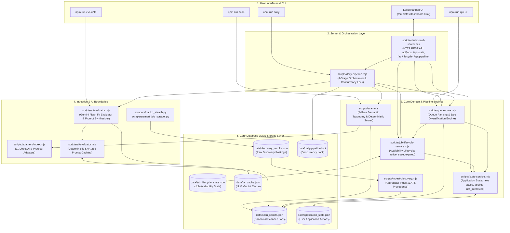
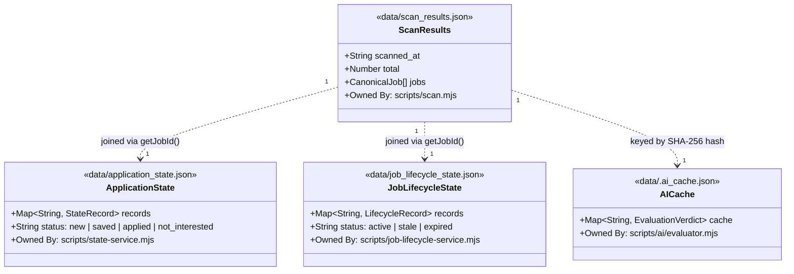

# System Architecture & Component Design — Career-Ops India

**Career-Ops India** is an autonomous, agentic, zero-database career pipeline designed for the Indian technology job market. It pairs with modern AI developer environments (Google Gemini CLI and Anthropic Claude Code) to provide direct ATS ingestion, deterministic taxonomy scoring, LLM fit evaluation, orthogonal state management, and a local reactive Kanban dashboard.

---

## 1. High-Level System Architecture

---

## 2. Subsystem Breakdown & Component Responsibilities

| Subsystem | Primary Modules | Architectural Responsibility | Key Inputs / Outputs |
|---|---|---|---|
| **Orchestration** | `daily-pipeline.mjs`, `dashboard-server.mjs` | Controls high-level execution, enforces single-process concurrency locking, serves REST APIs, and coordinates multi-stage daily job hunts. | Input: CLI args / HTTP POST Output: Telemetry status, HTTP JSON responses |
| **Ingestion** | `scan.mjs`, `adapters/*`, `scrapers/*` | Queries 65+ employer ATS boards via direct HTTP APIs without browser automation; normalizes disparate payloads into `CanonicalJob` schema. | Input: `portals/india.yml` Output: `data/scan_results.json` |
| **Semantic Taxonomy** | `scan.mjs` | Multi-gate filtering (Hard Exclusions $\rightarrow$ Function Classification $\rightarrow$ Experience/Seniority Normalization $\rightarrow$ Deterministic 100-pt Scoring). | Input: Raw ATS job payloads Output: Filtered & scored job entities |
| **AI Evaluation** | `ai/evaluator.mjs`, `ai/prompt.mjs`, `ai/provider.mjs` | Selects high-priority unevaluated jobs, synthesizes candidate CV with JD requirements, queries Gemini Flash, and caches verdicts by SHA-256 prompt hash. | Input: `cv.md`, `scan_results.json` Output: `ai_evaluation` metadata, `data/.ai_cache.json` |
| **Application State** | `state-service.mjs` | Tracks user application actions (`new`, `saved`, `applied`, `not_interested`) with deterministic job IDs and atomic file writes. | Input: Job ID + action Output: `data/application_state.json` |
| **Job Lifecycle** | `job-lifecycle-service.mjs` | Tracks portal posting availability (`active`, `stale`, `expired`) with automated rescan reconciliation and quota-freeing manual expiration. | Input: Scanned jobs + user action Output: `data/job_lifecycle_state.json` |
| **Queue & Ranking** | `queue-core.mjs`, `queue.mjs` | Enforces ranking precedence (`APPLY` > `CONSIDER` > `UNEVAL` > `STRETCH`) and limits company recommendations to max 5/company. | Input: `scan_results`, `app_state`, `lifecycle` Output: Partitioned, diversified queues |
| **User Interface** | `templates/dashboard.html` | Pure HTML5/vanilla JS single-page dashboard with Kanban columns, live pipeline trigger, filtering, and manual action hooks. | Input: `GET /api/jobs`, `GET /api/state` Output: DOM rendered UI |

---

## 3. Data Ownership & Storage Boundaries

The platform strictly maintains zero shared mutable state. Data ownership is partitioned as follows:

1. **`data/scan_results.json`**:
   - **Exclusive Writer**: `scripts/scan.mjs`.
   - **Content**: Canonical scraped postings, deterministic taxonomy scores, and attached AI evaluation metadata.
   - **Guarantee**: Scanner never mutates user application state or lifecycle state.

2. **`data/application_state.json`**:
   - **Exclusive Writer**: `scripts/state-service.mjs`.
   - **Content**: User interaction history (`applied`, `saved`, `not_interested`).
   - **Guarantee**: Never modified by scan runs, AI evaluations, or pipeline rebuilds.

3. **`data/job_lifecycle_state.json`**:
   - **Exclusive Writer**: `scripts/job-lifecycle-service.mjs`.
   - **Content**: Availability records (`expired`, `stale`, `active`).
   - **Guarantee**: Decoupled from user actions. Expiring a job does NOT mark it applied; applying does NOT alter lifecycle.

4. **`data/.ai_cache.json`**:
   - **Exclusive Writer**: `scripts/ai/evaluator.mjs`.
   - **Content**: SHA-256 hash-keyed evaluation results.
   - **Guarantee**: 100% token reuse for identical JD and profile inputs across runs.
