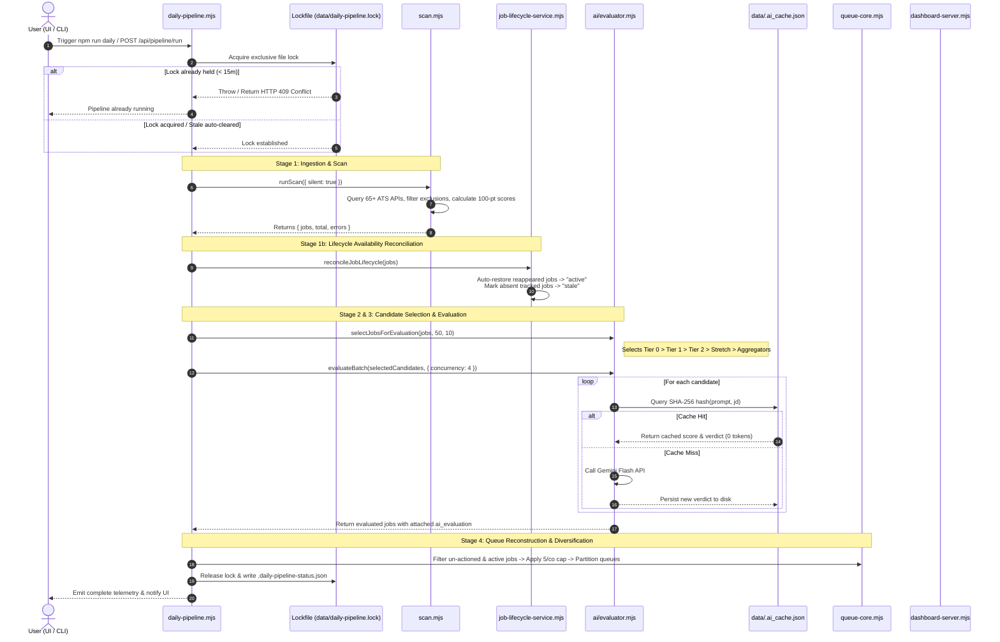
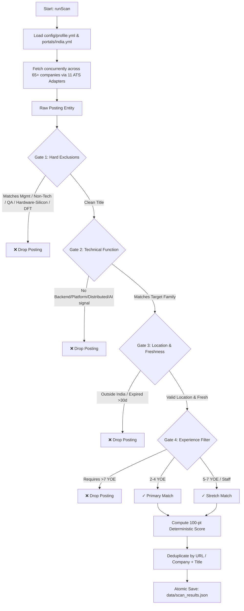
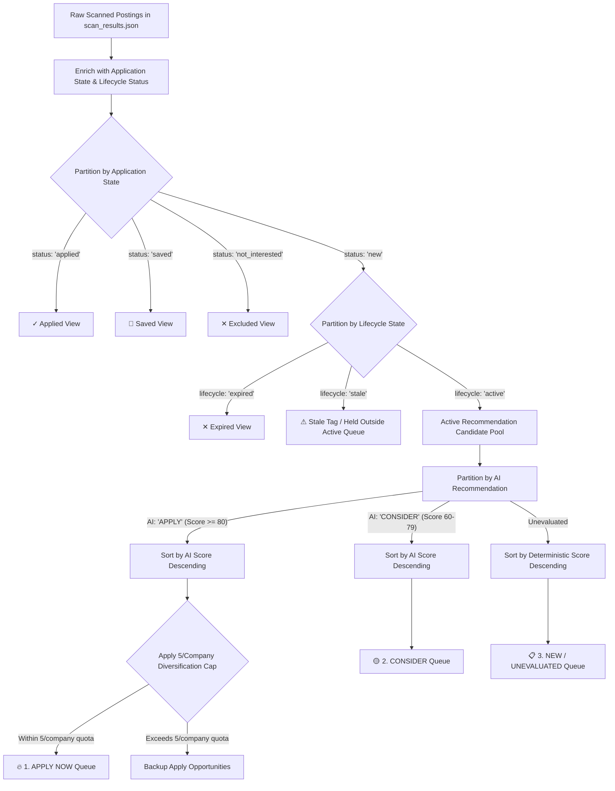
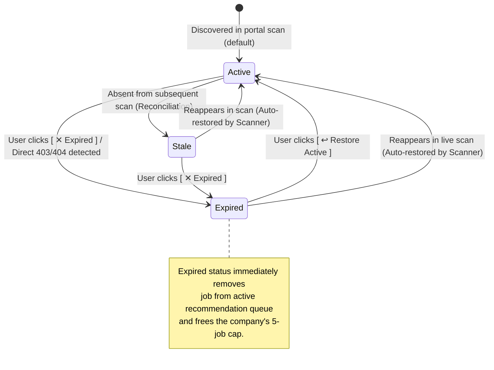
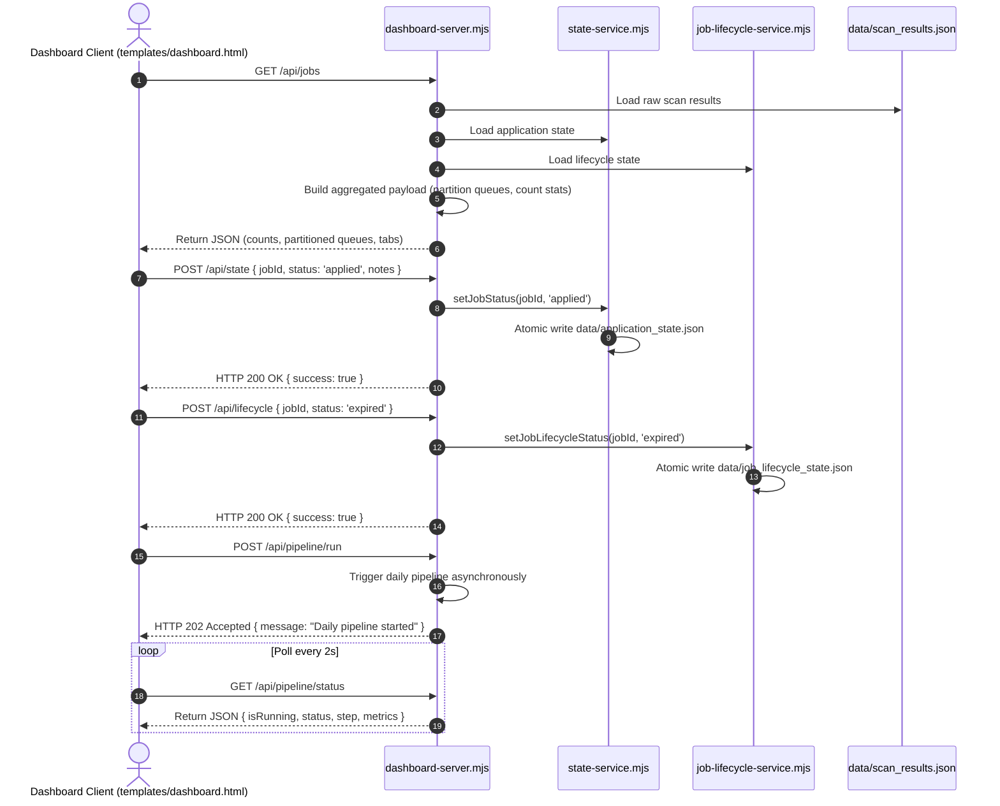

# Data Flow & Execution Specifications — Career-Ops India

This document details the exact execution paths, data mutations, and component interactions across the five primary workflows in **Career-Ops India**.

---

## 1. Daily Pipeline Workflow (One-Click Job Hunt)

---

## 2. Ingestion, Taxonomy & Normalization Flow

---

## 3. Queue Construction & Company Diversification Flow

---

## 4. Job Lifecycle Availability State Machine

---

## 5. Dashboard REST API Interaction Flow

