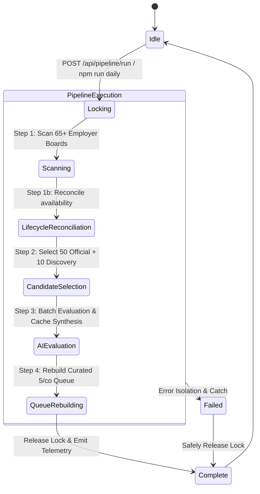

# Daily Job Hunt Pipeline — Orchestration & Invariants

The **Daily Job Hunt Pipeline** (`scripts/daily-pipeline.mjs`) is the central one-click command orchestrating scanning, evaluation, caching, queue construction, and dashboard sync.

---

## 1. Execution Pipeline Stages



---

## 2. Pipeline Invariants & Safety Guarantees

### A. Process Locking & Concurrency Control
- **Lock File**: `data/daily-pipeline.lock`.
- **Concurrent Request Blocking**: If a pipeline run is already in progress, new requests receive `HTTP 409 Conflict`.
- **Stale Lock Auto-Recovery**: If a lock file is $> 15$ minutes old (indicating an abrupt process termination), it is automatically cleaned up and logged without manual intervention.

### B. Daily Candidate Evaluation Budgets
- **Official ATS / Employer Careers**: Evaluates up to **50** top unevaluated candidates per day (Tier 0 $\rightarrow$ Tier 1 $\rightarrow$ Tier 2 $\rightarrow$ Stretch).
- **Aggregators / Discovery**: Evaluates up to **10** candidates per day.
- **Cache Synthesis**: Previously evaluated postings are recognized via SHA-256 hash and consume **0** LLM credits.

### C. Error Isolation
- If an individual ATS adapter fails (e.g. temporary network timeout or rate limit), the error is isolated in the error accumulator and the pipeline completes successfully across the remaining 60+ portals.
- If an individual AI call fails or times out, the rest of the batch continues without data corruption.

---

## 3. CLI Commands

```bash
# Run the complete live daily job hunt pipeline
npm run daily

# Run in dry-run mode (synthesizes evaluations with mock AI without consuming credits)
npm run daily -- --dry-run

# Run with custom evaluation limit and concurrency
node scripts/daily-pipeline.mjs --employerAtsLimit=30 --concurrency=4
```

