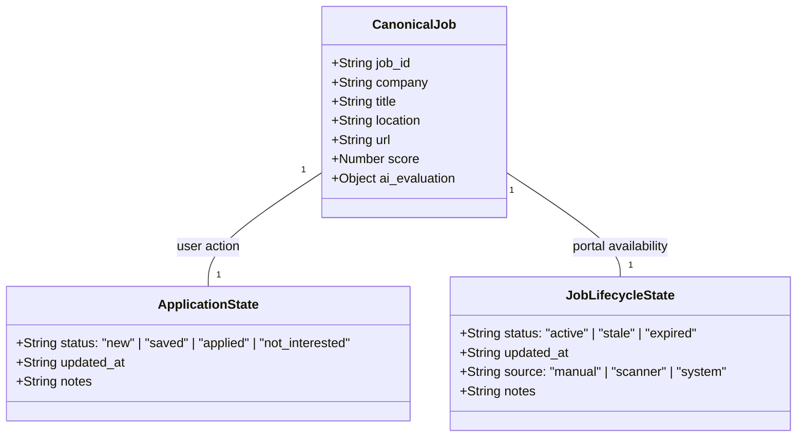

# Multi-Dimensional State Model — Career-Ops India

Career-Ops India enforces a fundamental architectural separation between **Application State**, **Job Availability Lifecycle**, and the **Canonical Scanned Dataset**.

---

## 1. Dimensional Separation

---

## 2. State Dimensions

### Dimension 1: Canonical Job Dataset (`data/scan_results.json`)
- **Authoritative source of scanned job postings**.
- Generated exclusively by `scripts/scan.mjs`.
- Completely decoupled from personal user actions.

### Dimension 2: Application State (`data/application_state.json`)
- Stores **user actions** against jobs:
  - `new`: Default un-actioned state.
  - `saved`: Bookmarked by user for later review.
  - `applied`: Application submitted (or interview/oa/offer/rejected).
  - `not_interested`: Explicitly passed by user.
- Survives re-scans, metadata updates, and scoring recalculations.

### Dimension 3: Job Availability Lifecycle (`data/job_lifecycle_state.json`)
- Stores **portal availability & validity**:
  - `active`: Verified open and available.
  - `stale`: Absent from latest scan (retained in history, excluded from top recommendations).
  - `expired`: Manually or structurally marked closed/expired.
- **Auto-Restoration**: If a previously expired or stale job reappears in a live portal scan, its lifecycle is automatically restored to `active` (`source: "scanner"`).

---

## 3. State Orthogonality Examples

| Scenario | Application State | Lifecycle State | Resulting Behavior |
|---|---|---|---|
| New posting discovered | `new` | `active` | Surfaced in active recommendation queue |
| User applies to job | `applied` | `active` | Isolated in **✓ Applied** tab; excluded from daily recommendations |
| User saves job for weekend review | `saved` | `active` | Isolated in **💾 Saved** tab |
| Employer closes requisition on Workday | `new` | `expired` | Isolated in **✕ Expired** tab; frees up 5/co diversification quota |
| User applied, then employer closes role | `applied` | `expired` | Tracked under **✓ Applied** AND **✕ Expired** without conflict |
| Job missing from 1 scan | `new` | `stale` | Tagged with `⚠ STALE`; held outside recommendations |

